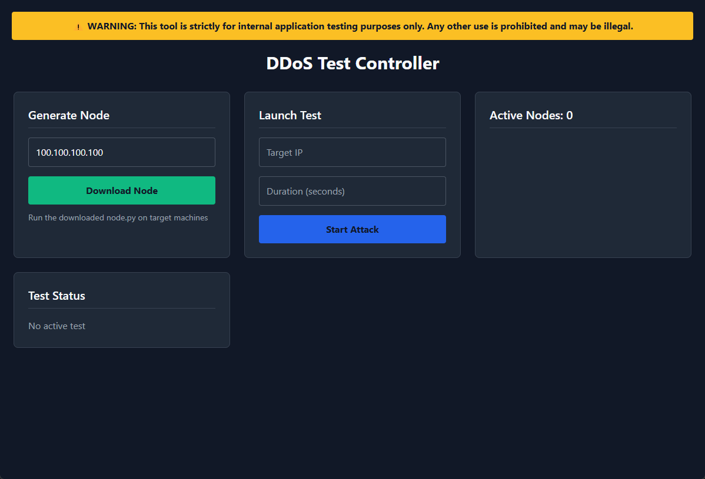

# DOS
Denial Of Service application which has the ability to simulate a real attack by utilizing nodes to perform a distributed attack to a single device on the local network using various types of attack vectors.



## Usage
Server
```
pip install -r requirements.txt
python server.py
```

Deploying nodes
```
pip install aiohttp requests
python node.py
```

## Attack Vectors

### SYN Flood  
A SYN Flood is a denial-of-service attack where the attacker sends a rapid succession of TCP SYN requests to a target, overwhelming its ability to handle legitimate connections by filling the connection queue.  

### UDP Flood  
A UDP Flood overwhelms a target by flooding it with User Datagram Protocol (UDP) packets on random ports, forcing the device to process malformed or unresolvable requests and exhausting its resources.  

### ICMP Flood  
An ICMP Flood (or "Ping Flood") bombards a target with excessive ICMP echo-request (ping) packets, aiming to saturate bandwidth or overload the device’s capacity to respond.  

### Slowloris  
Slowloris is a low-bandwidth DDoS attack that opens multiple partial HTTP connections to a target and keeps them open indefinitely, exhausting the server’s concurrent connection pool.  

### UPnP Abuse  
UPnP Abuse exploits Universal Plug and Play (UPnP) protocols to trick routers into opening unauthorized ports or forwarding traffic, potentially exposing internal networks to external attacks.  

### Credential Stuffing  
Credential Stuffing automates login attempts using common default credentials (e.g., `admin:admin`) to gain unauthorized access to router admin interfaces or services.

## Disclaimer
This tool is for educational purposes only. The author will not be responsible for any misuse of this tool.
